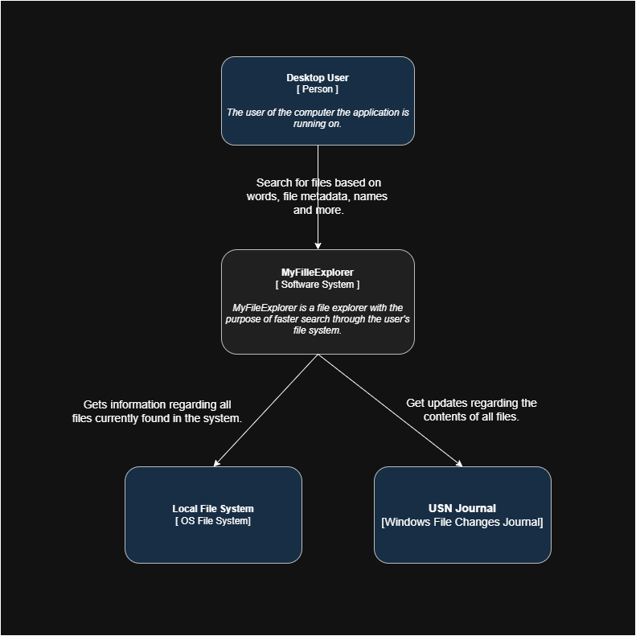
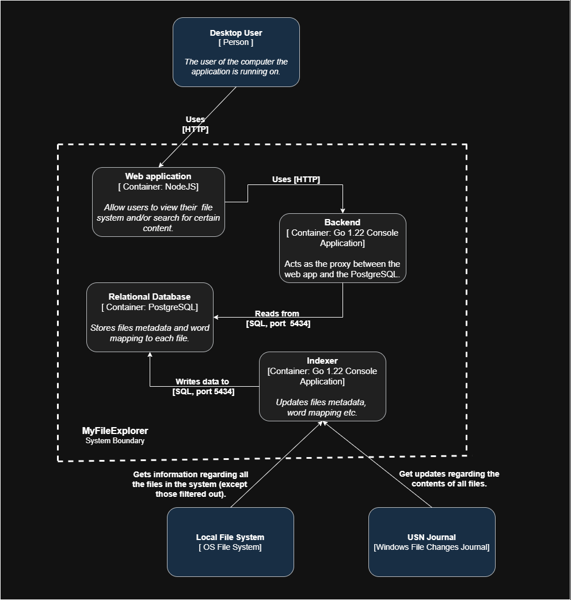
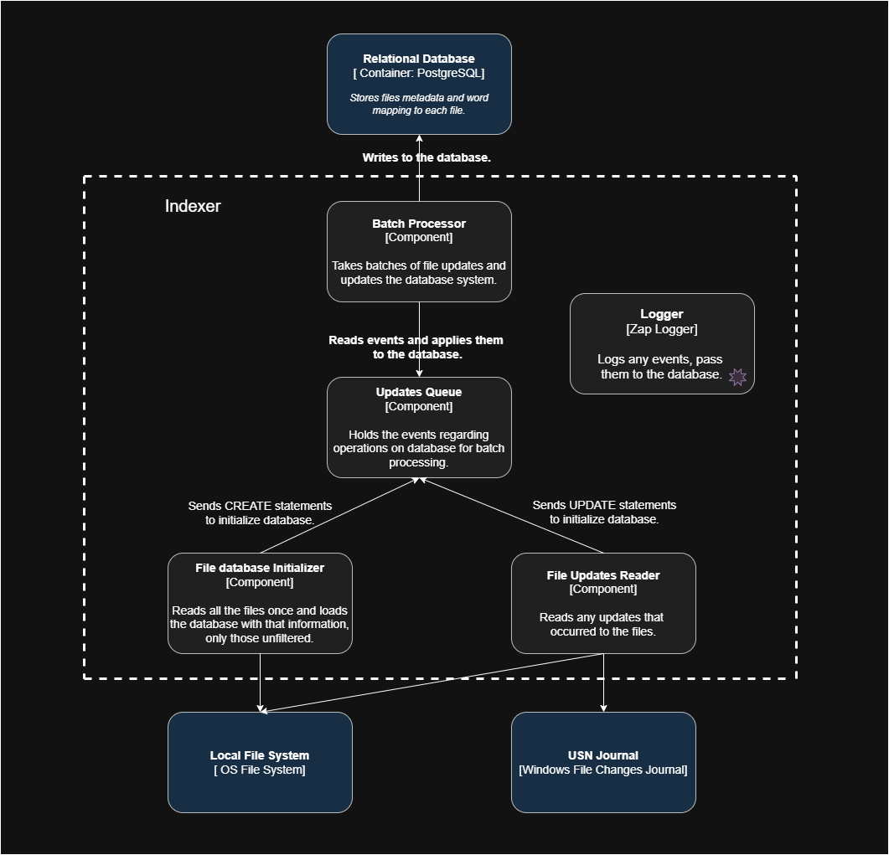
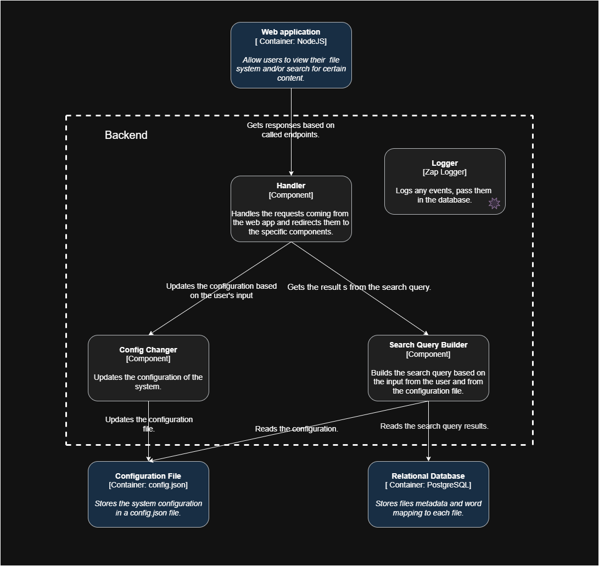

# Architecture

## Context 

The goal of the system is to be able to handle basic file searching operations,
commonly found in application like [File Explorer](https://support.microsoft.com/en-us/windows/file-explorer-in-windows-ef370130-1cca-9dc5-e0df-2f7416fe1cb1),
while also having more powerful features such as **file preview**, **content search** and **filtering**.

The following are the **non-functional** requirements of the system:

- Crawl the local file system and extract all relevant data
- Filter any unwanted data (**configurable at run time**)
- Content search over files (single/multi-word, name, path, extensions)
- Root directory relative to the search should also be configurable at run time
- User should be able to preview the first 3 lines of every file that resulted
from his search

For a better understand of the architecture below I will present the **C4 model** of the system.

## 1. System Context

The following is an overview of the interaction with the system and the resources the
system is interacting with.

## 2. Containers

The system will be based on **4 independent running** containers which.

#### Web application

- handles the interaction of the user with the system
- it is the frontend

#### Backend

- proxy between the web application and the system resources.
- filters out data that the user specifically specified
- ensures the web application has as little access as possible to the database

#### Relational database

- the backbone of this system
- stores and indexes the data corresponding to a predefined schema
- allows **fast** and **responsive** search

#### Indexer

- is responsible for **initializing** the database with the necessary data
- checks the **USN Journal** and performs updates correspondingly

## 3. Components

### Indexer

Its role is filling the database with data and performing necessary updates.

#### Batch Processor

- take update events from the **Updates Queue** and performs the corresponding operations
on the database
- only component interacting with the database in this component

#### Updates Queue

- defines allowed operations on database (**update events** mentioned above are inserts, updates and deletes)
- **thread safe**, it allows one insertion in the queue by a single thread

#### File database initializer

**IMPORTANT NOTE:**
Must be the **first** and **only** component running when the system is **first** started

- crawls the local file system and sends inserts to the **Updates Queue**
- has its own **.file_ignore** file which will keep out, certain files, **PERMANENTLY** from the system

#### File Updates Reader

- separate goroutine running in the background of the Indexer which finds updates on the file
system and sends update/delete events to the **Updates queue**

### Backend

Proxy/Middleman between the web application and the system database.

#### Handler

- handles incoming HTTP request from the web app and routes them to specified endpoints
- sends and configuration changes requested by the user

#### Config Changer

- updates the **config.json** file which affects the search query

#### Search Query Builder

- reads the **config.json** file to know the configuration of the search feature
- gets the requested resources from the **Handler** and builds the search query 
- retrieves the data gotten from the search query